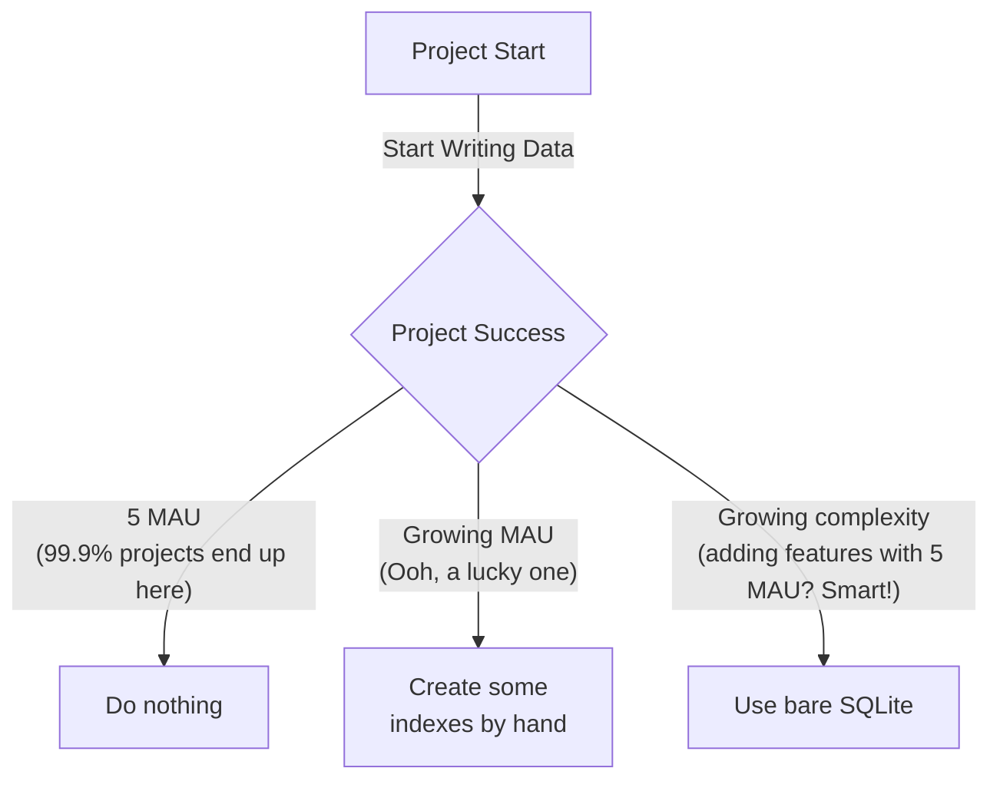

# litestore

`litestore` is a schemaless but typesafe storage for go powered by SQLite/json.

It is minimalistic, opinionated, and allows you to start using it in shortest time
while not impeding your success in the future.

It is based on SQLite which combined with [litestream](https://litestream.io/)
creates a virtually free serverless database.

## Example

## Key Features
- Not an ORM, but a store
- Minimalistic and opinionated
- Schemaless but typesafe
- Supports transactions
- Easy to start using (no schema, no migrations, no SQL queries to write)
- Add indexes as performance becomes a concern
- Add classic SQL as complexity needs grow
- Eject and replace with custom store anytime

## Implementation Details
`litestore` consists of two components

- `EntityStore` has a CRUD-like (Create, Read, Update, Delete) personality:
    - `Get(ctx, entityID)`: Fetches a single, unique entity.
    - `Set(ctx, entityID, entity)`: Creates or replaces an entity at a specific key. It's idempotent (may be executed multiple times with the same result)
    - `Update(ctx, entityID, partial map[string]any)`: Performs a partial modification of an existing entity.
    - The key is the canonical identifier.
 • `RecordStore` has a Stream-like (Append-only) personality:
    • Add(entityID, item): Appends a new record to a collection. It is not idempotent; calling it twice creates two records.
    • List(entityID): Retrieves a list of recent records.
    • There is no Update method. You don't typically "update" a log entry or an activity feed item; you might add a new one that supersedes it.

## Why
OK so I've been launching a lot of pet projects lately.
In a pet project, you want your costs to be minimal, preferably zero.
This is something we should strive for in a professional setting as well, if you ask me.

So for my database needs, I've been using SQLite + litestream as a great semi-resilient serverless database.
At some point, I got tired of constant migrations and schema changes, 
and decided to go all `CREATE TABLE data (key TEXT PRIMARY KEY, json TEXT NOT NULL)`

That worked while I had to manage user settings and such, 

## Suitable Projects
Expected lifecycle of a project using `litestore` + SQLite + litestream looks like this

---------
Based on our work together, here is my overall analysis of the litestore library.

Overall Assessment

This is a very well-designed, modern, and focused Go library. It provides a clean, type-safe, and idiomatic API for common persistence patterns on
top of an embedded SQLite database. It successfully avoids the complexity of a full ORM while offering much more structure and safety than raw SQL
queries.

It's an excellent example of how to leverage modern Go features like generics and context-awareness to create a powerful and easy-to-use tool.

────────────────────────────────────────────────────────────────────────────────────────────────────────────────────────────────────────────────────
Strengths (What it does well)

 1 Excellent Use of Generics: The use of [T any] in both EntityStore and RecordsStore is the library's standout feature. It provides compile-time
   type safety, eliminates the need for type assertions in user code, and makes the API incredibly clean and intuitive.
 2 Idiomatic API Design: The library follows modern Go best practices:
    • Context-Awareness: All database-interacting methods correctly accept a context.Context, allowing for proper cancellation, timeouts, and
      deadline propagation.
    • Resource Management: The Close() methods on the stores ensure that prepared statements are properly released, preventing resource leaks.
    • Clear Naming: The names EntityStore (for key-value access) and RecordsStore (for collections) clearly communicate their purpose.
 3 Good Balance of Simplicity and Power:
    • The Predicate system (Filter, And, Or) is a great abstraction. It allows users to build complex queries in a structured way without exposing
      them to the messiness of SQL string concatenation, while still being powerful enough for many use cases.
    • It doesn't try to be a full-featured ORM, which keeps its scope narrow and its implementation understandable.
 4 Performance-Conscious: The use of prepared statements for all repetitive queries (Get, Set, Add, List) shows a commitment to performance by
   reducing the overhead of query parsing on the database.
 5 Zero-Dependency and Embeddable: By building on go-sqlite3, the entire database can be a single file on disk or even in-memory, making it perfect
   for simple applications, command-line tools, and prototypes without requiring an external database server.

────────────────────────────────────────────────────────────────────────────────────────────────────────────────────────────────────────────────────
Areas for Improvement (Constructive Suggestions)

 1 Error Handling Granularity: The library currently returns errors created with fmt.Errorf. This is fine for logging, but it makes it difficult for
   calling code to programmatically handle different error conditions. For example, you can't easily distinguish between a "not found" error and a
   "database connection failed" error.
    • Suggestion: Define exported error variables (e.g., var ErrNotFound = errors.New("not found")) or custom error types. This would allow users to
      write code like if errors.Is(err, litestore.ErrNotFound) { ... }.
 2 Lack of User-Managed Transactions: The Update method correctly uses a transaction internally, but the library doesn't provide a way for a user to
   run multiple operations in a single, atomic transaction. For example, you can't atomically Set an entity and then Add a record to its collection.
    • Suggestion: Consider adding a WithTransaction method that would provide a transactional version of the store to a callback function, ensuring
      that all operations within the callback are committed or rolled back together.
 3 Query Performance at Scale: The ForEach method relies on json_extract to query fields within the JSON blob. While flexible, this approach cannot
   use database indexes and will result in a full table scan for every query. This will be very slow on tables with hundreds of thousands or
   millions of rows.
    • Suggestion: This is a fundamental trade-off of the JSON-in-a-column design. For now, it would be valuable to document this limitation clearly.
      A future, more advanced version could explore creating actual indexed columns for specific JSON fields that need to be queried frequently.

Conclusion

This is a high-quality library that is exceptionally good for its intended purpose: providing simple, type-safe, and embeddable persistence for Go
applications. Its strengths in API design and modern Go practices far outweigh its limitations.

It would be a perfect choice for:

 • Configuration management for an application.
 • Persistence for desktop or CLI tools.
 • A simple caching layer.
 • Prototyping and MVPs where a full database is overkill.

I would confidently recommend it for any project that fits within its scope.

